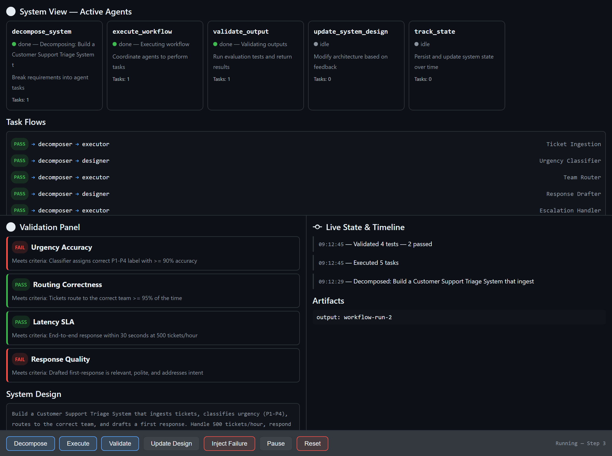
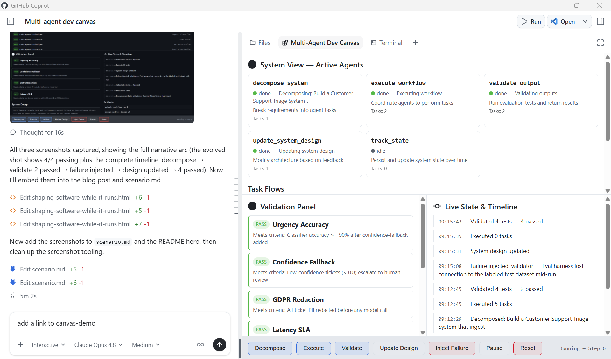

# 🎨 Multi-Agent Dev Canvas

[](https://github.com/leestott/copilot-canvas-runtime)
[](https://nodejs.org)
[](#quick-start)
[](https://github.com/leestott/copilot-canvas-runtime/commits/main)
[](https://github.com/leestott/copilot-canvas-runtime/stargazers)
[](LICENSE)

A GitHub Copilot Canvas extension that demonstrates **Canvas as a runtime observability and control plane** for multi-agent development — not a traditional UI builder.

> **Canvas redefines software development** by shifting from writing static code to orchestrating living systems, where developers and AI co-create, observe, and evolve solutions in real time.

📦 **Repository:** https://github.com/leestott/copilot-canvas-runtime



## The Experience in the GitHub Copilot App

This is what it looks like live in the **GitHub Copilot App** — the AI chat on the
left driving the system, and the Canvas panel on the right updating in real time
as a shared Human ↔ AI ↔ System surface:



## What This Is

Traditional UIs are for **using** software. Canvas is for **shaping** software while it runs.

This canvas provides:

- **System View** — Live agent cards showing status, responsibilities, and task counts
- **Task Flows** — Visual pipeline of work routing between agents
- **Validation Panel** — Structured test results with pass/fail badges and reasoning
- **Live State Timeline** — Chronological log of every state mutation
- **Controls** — Trigger agent actions, pause/resume execution, inject failures, and reset

## Agent-Callable Actions

| Action | Description |
|--------|-------------|
| `decompose_system` | Break requirements into agent tasks and update the task flow graph |
| `execute_workflow` | Coordinate agents to perform pending tasks |
| `validate_output` | Run evaluation tests and return structured pass/fail results |
| `update_system_design` | Modify architecture, constraints, or components live |
| `track_state` | Read full system state including agents, flows, and history |
| `inject_failure` | Force an agent into error state to test adaptation |
| `pause_resume` | Toggle execution on/off |

## Scenario Walkthrough

Want to see Canvas in action? **[scenario.md](scenario.md)** documents a complete,
reproducible demo — taking a *Customer Support Triage System* from a single
requirement through decomposition, execution, validation, fault injection, and
live design evolution. It also explains **how Canvas apps empower developers** and
why Canvas is for *test validation and implementation of agent‑driven solutions* —
not for building a DevOps board.

> You don't build Canvas instead of your UI — you use Canvas to figure out, test,
> and evolve the UI and system **before and during** building it.

- 📖 **[scenario.md](scenario.md)** — the full five‑beat walkthrough
- 🧑‍💻 **[prompts/canvas-showcase-prompt.md](prompts/canvas-showcase-prompt.md)** — a ready‑to‑paste prompt for engineers to showcase Canvas
- ✍️ **[Blog: Shaping Software While It Runs](docs/blog/shaping-software-while-it-runs.html)** — the scenario as a narrative

## Quick Start

### Prerequisites

- [GitHub Copilot CLI](https://docs.github.com/en/copilot) with Canvas support
- Node.js v20+

### Install the Extension

The canvas extension lives at `.github/extensions/multi-agent-dev/extension.mjs`. To use it:

1. **Clone this repo** into your project or copy the `.github/extensions/multi-agent-dev/` folder into your own repo.

   ```bash
   git clone https://github.com/leestott/copilot-canvas-runtime.git
   ```

2. **Reload extensions** in GitHub Copilot CLI:
   ```
   extensions_reload
   ```

3. **Open the canvas**:
   ```
   open_canvas({ canvasId: "multi-agent-dev", instanceId: "dev-1" })
   ```

4. **Invoke actions** — either click the buttons in the canvas UI, or call from the agent:
   ```
   invoke_canvas_action({
     instanceId: "dev-1",
     actionName: "decompose_system",
     input: {
       requirements: "Build an AI code review agent",
       components: ["pr-ingestion", "code-analysis", "feedback-generator"]
     }
   })
   ```

## How It Works

The extension is a single `extension.mjs` file that:

1. **Registers a canvas** with the Copilot SDK via `createCanvas()`
2. **Starts a loopback HTTP server** per instance on an ephemeral port
3. **Pushes state updates** to the iframe via Server-Sent Events (SSE)
4. **Exposes dual interaction** — humans click buttons in the UI, AI agents call actions through the SDK; both mutate the same state

```
┌──────────────┐    SSE /events     ┌──────────────────┐
│  Canvas UI   │ ◄────────────────── │  extension.mjs   │
│  (iframe)    │ ────POST /trigger──►│  (Node.js)       │
└──────────────┘                     │                   │
                                     │  ◄── Agent calls  │
┌──────────────┐  invoke_canvas_     │      via SDK      │
│  Copilot CLI │ ──action──────────► │                   │
└──────────────┘                     └──────────────────┘
```

## Project Structure

```
canvasdemo/
├── .github/
│   └── extensions/
│       └── multi-agent-dev/
│           └── extension.mjs       # The canvas extension (single file)
├── docs/
│   └── blog/
│       ├── canvas-demo.png                       # Screenshot — after validation
│       ├── canvas-fault-injected.png             # Screenshot — fault injected
│       ├── canvas-evolved.png                    # Screenshot — evolved & recovered
│       ├── shaping-software-while-it-runs.html   # Scenario blog post
│       └── canvas-is-not-a-ui-builder.html       # Architecture deep-dive
├── prompts/
│   └── canvas-showcase-prompt.md   # Engineer prompt to showcase Canvas
├── ghcanvasapp.png                 # The canvas running in the GitHub Copilot App
├── scenario.md                     # Full demo scenario walkthrough
└── README.md
```

## Canvas vs. Figma vs. Traditional UIs

| Tool | Collaboration Model | Executes? |
|------|-------------------|-----------|
| **Figma** | Human ↔ Human | No — design only |
| **Traditional UI** | Human ↔ System | Yes — finished product |
| **Canvas** | Human ↔ AI ↔ System | Yes — living, evolving system |

## Blog Posts

- [Shaping Software While It Runs: A Canvas Scenario, Start to Finish](docs/blog/shaping-software-while-it-runs.html) — the demo scenario as a narrative
- [Canvas Is Not a UI Builder — It's a Runtime for Shaping Intelligent Systems](docs/blog/canvas-is-not-a-ui-builder.html) — the deeper architectural deep‑dive

## License

MIT — see [LICENSE](LICENSE).
