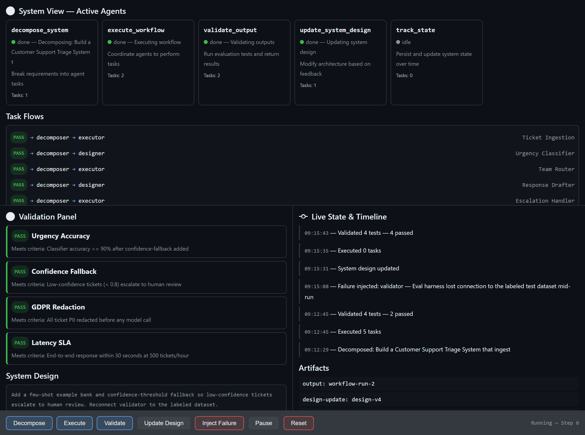

# 🧪 Scenario: Shaping an Agent‑Driven System with Canvas

> **The point of this scenario is not the board.** It is what the board lets you
> *do*: decompose, execute, validate, break, and evolve an agent‑driven system
> **while it runs** — with a human and an AI acting on the same live surface.

This document walks through the exact demo used with the **Multi‑Agent Dev
Canvas** extension in this repo. It is a concrete, reproducible scenario you can
replay click‑by‑click or drive entirely from the AI agent.

---

## Why this scenario exists

When people first meet Canvas, the instinct is to build a *dashboard* — a DevOps
board, a status page, a pretty UI. We tried that. **We all agreed it was the
wrong use case.**

Canvas is not for building the UI your users will eventually use. Canvas is for
**test validation and implementation of agent‑driven solutions** — the messy,
invisible work of figuring out *whether the system even works* before and during
building it.

| | Traditional UI | Canvas |
|---|---|---|
| **For** | *Using* finished software | *Shaping* software while it runs |
| **Audience** | End users | Developers **and** AI agents |
| **Lifetime** | Ships to production | Lives during design/test/evolve |
| **Solves** | User problems | Observability, validation, fault‑tolerance |

> Canvas solves problems your final UI should **never** try to solve in a visible
> way. You wouldn't ship your debugger to users — but you absolutely need one
> while building.

---

## The system under test

**Build a Customer Support Triage System** — an agent‑driven service that:

1. Ingests incoming support tickets
2. Classifies urgency (P1–P4)
3. Routes each ticket to the right team (Billing / Technical / Account / General)
4. Drafts a first‑response reply

**Non‑functional constraints:** handle 500 tickets/hour, respond within 30s.

Five specialist agents collaborate on the surface: `decomposer`, `executor`,
`validator`, `designer`, `tracker`.


*The canvas after the first validation run — two tests pass, two fail, shown in
context beside the agents and task flows that produced them.*

---

## The five‑beat walkthrough

Each beat can be triggered by a **human clicking a button** in the canvas *or*
by the **AI calling `invoke_canvas_action`**. Both mutate the same state and
stream back to the same UI over Server‑Sent Events.

### Beat 1 — Decompose
Feed the requirement in. The decomposer fans the five components out into a
task‑flow graph, routing each task to an `executor` or `designer` agent.

```text
decomposer → executor   Ticket Ingestion      [pending]
decomposer → designer   Urgency Classifier    [pending]
decomposer → executor   Team Router           [pending]
decomposer → designer   Response Drafter      [pending]
decomposer → executor   Escalation Handler    [pending]
```

> **Canvas value:** the decomposition is *visible and inspectable* the instant it
> happens — not buried in a log you grep later.

### Beat 2 — Execute
Coordinate the agents to work the pending tasks. Cards pulse blue as work moves
through the pipeline; the live timeline records every mutation with a timestamp.

### Beat 3 — Validate
Run evaluation tests against the current outputs. This is **not** a separate CI
pipeline — it is a validation surface embedded in the development loop.

| Test | Result |
|---|---|
| Urgency Accuracy (≥ 90%) | ❌ **fail** |
| Routing Correctness (≥ 95%) | ✅ pass |
| Latency SLA (< 30s @ 500/hr) | ✅ pass |
| Response Quality | ✅ pass |

> **Canvas value:** you see the failure *in context* — next to the agent and the
> flow that produced it — the moment it happens.

### Beat 4 — Inject Failure
Force the `validator` into an error state (e.g. "eval harness lost connection to
the dataset"). The card glows red; the timeline logs `⚠ Failure injected`. This
is chaos engineering applied **during** development, visible in real time.

> **Canvas value:** you test *adaptation*, not just the happy path. Does the
> orchestrator recover? Do downstream tasks fail gracefully?

### Beat 5 — Update Design + Re‑validate
Respond to the failed test by **evolving the system live**: add a confidence
fallback (escalate low‑confidence tickets to a human) and a **GDPR data‑handling
constraint** (redact PII before any model call). Resume execution, re‑run
validation:

| Test | Result |
|---|---|
| Urgency Accuracy (re‑run) | ✅ pass |
| Confidence Fallback | ✅ pass |
| GDPR Redaction | ✅ pass |

The loop closes: a design decision produced a measurable outcome, you saw it
fail, you changed the design, and you proved the fix — all on one surface,
without leaving the runtime.


*After evolving the design (confidence fallback + GDPR redaction) and
re‑validating: all four tests pass, and the timeline captures the full journey
from decomposition through failure to recovery.*

---

## How Canvas apps enable developers

This scenario demonstrates four things traditional tooling makes hard:

1. **End‑to‑end design, visible.** A single requirement decomposes into agents,
   flows, and validations you can *watch* — no context‑switching between editor,
   terminal, test runner, and monitoring dashboard.
2. **Live agent‑collaboration observability.** See hand‑offs, pending work, and
   bottlenecks in multi‑agent orchestration — the kind of insight you need to
   debug agents but would never expose in a production UI.
3. **Fault injection and adaptation testing.** Break the system on purpose and
   watch it respond, catching integration failures before they reach prod.
4. **Validation‑driven iteration.** Define criteria → run → see failures →
   evolve the design → re‑run, as a continuous feedback loop instead of an
   after‑thought.

> **You don't build Canvas instead of your UI.** You use Canvas to figure out,
> test, and evolve the UI and system *before and during* building it.

---

## Human ↔ AI ↔ System (and where multi‑user fits)

Canvas is collaborative in the way Figma is — a shared, visual space where
multiple participants act on the same surface. The difference:

- **Figma** is **Human ↔ Human**. Nothing executes; it's design only.
- **Traditional UI** is **Human ↔ System**. A finished product for end users.
- **Canvas** is **Human ↔ AI ↔ System**. A runtime where things actually
  *execute*, steered by a developer and an AI together.

A natural next question: *why isn't Canvas multi‑user, scoped per project/repo?*
It already has the ingredients — it's a shared space, it's visual, it's
collaborative, and multiple participants (human and AI) interact with the same
surface. A repo‑scoped, multi‑participant Canvas would turn it into a shared
runtime for a whole team to observe and shape an agent system together. That is
the compelling frontier — and the current blocker for wider experimentation is
licensing, not the idea.

---

## The positioner

> **Canvas redefines software development** by shifting from writing static code
> to orchestrating living systems, where developers and AI co‑create, observe,
> and evolve solutions in real time. Instead of building UIs for users, we build
> interactive environments for agents — turning debugging, testing, and
> execution into a continuous, visual feedback loop that accelerates innovation
> and brings ideas to production faster than ever.

---

## Replay it yourself

1. Reload the extension: `extensions_reload`
2. Open the canvas: `open_canvas({ canvasId: "multi-agent-dev", instanceId: "dev-1" })`
3. Click through **Decompose → Execute → Validate → Inject Failure → Update
   Design → Validate**, *or* drive each beat from the AI with
   `invoke_canvas_action`.

See also: the [blog post](docs/blog/shaping-software-while-it-runs.html) and the
[engineer showcase prompt](prompts/canvas-showcase-prompt.md).

---

**Repository:** <https://github.com/leestott/copilot-canvas-runtime>
